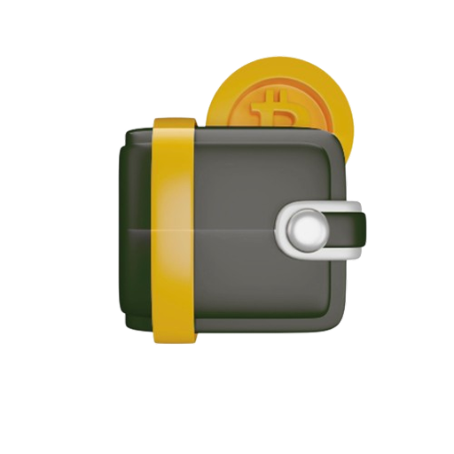

<div align="center">
  
    <h1 align="center">Coinverge</h1>
  <p align="center">
    <strong> Multi-Chain Cryptocurrency Wallet</strong>
  </p>
  <p align="center">
    A production-ready mobile wallet supporting Ethereum and Solana blockchains
  </p>

  <p align="center">
    
    
    
    
  </p>
</div>

---

## 📋 Table of Contents

- [About](#about)
- [Features](#features)
- [Tech Stack](#tech-stack)
- [Getting Started](#getting-started)
- [Project Structure](#project-structure)
- [Development](#development)
- [Security](#security)
- [Blockchain Support](#blockchain-support)
- [Testing](#testing)
- [Deployment](#deployment)
- [Roadmap](#roadmap)
- [Contributing](#contributing)
- [License](#license)

---

## 📖 About

**Coinverge** is a multi-chain cryptocurrency wallet application built with React Native and TypeScript. It provides a secure, non-custodial solution for managing digital assets across Ethereum and Solana blockchains on both iOS and Android platforms.

### Key Highlights

- ✅ **Multi-Chain Support**: Native support for Ethereum and Solana blockchains
- ✅ **Enterprise Security**: AES-256 encryption with PBKDF2 key derivation and hardware-backed secure storage
- ✅ **Non-Custodial**: Users maintain full control of their private keys
- ✅ **Production Ready**: Comprehensive error handling, transaction management, and real-time balance updates
- ✅ **Modern Architecture**: Clean code structure with Redux state management and TypeScript type safety

---

## 🛠️ Tech Stack

### Core Technologies

| Technology | Version | Purpose |
|------------|---------|---------|
| React Native | 0.76.9 | Mobile framework |
| TypeScript | 5.3.3 | Type safety and developer experience |
| Expo | 52.0.47 | Development platform and tooling |
| Redux Toolkit | 2.2.3 | State management |
| Ethers.js | 6.12.0 | Ethereum blockchain interactions |
| @solana/web3.js | 1.91.7 | Solana blockchain interactions |
| Alchemy SDK | 3.2.1 | Unified blockchain data access |
| Styled Components | 6.1.8 | Component styling |

### Security

- **Encryption**: AES-256 with PBKDF2 (10,000 iterations)
- **Storage**: Expo SecureStore (Keychain/Keystore)
- **Key Management**: BIP39 mnemonic phrases with BIP44 derivation paths
- **Validation**: Address validation for all supported chains

### Development Tools

- **Package Manager**: Yarn 1.22.22
- **Linting**: ESLint (via Expo)
- **Testing**: Jest with React Native Testing Library
- **State Persistence**: Redux Persist with AsyncStorage

---


## ✨ Features

### Multi-Chain Wallet Management

#### Supported Blockchains
- **Ethereum** (Mainnet & Sepolia Testnet)
- **Solana** (Mainnet & Devnet)

#### Wallet Operations
- ✅ **Create New Wallets**: Generate secure wallets with BIP39 mnemonic phrases
- ✅ **Import Existing Wallets**: Restore wallets using 12-word seed phrases
- ✅ **Multi-Account Support**: Manage multiple accounts from single seed phrase
- ✅ **HD Wallet Derivation**: BIP44 compliant derivation paths
- ✅ **Account Customization**: Rename and organize multiple accounts

### Transaction Management

#### Send & Receive
- ✅ **Multi-Chain Transactions**: Send/receive on Ethereum and Solana
- ✅ **Gas Fee Calculation**: Real-time gas estimation for EVM chains
- ✅ **Transaction Confirmation**: Real-time transaction status tracking
- ✅ **QR Code Integration**: Scan and generate QR codes for addresses
- ✅ **Address Validation**: Chain-specific address validation
- ✅ **Transaction History**: Complete transaction history with filtering

#### Transaction Features
- ✅ **Real-Time Updates**: WebSocket connections for instant balance updates
- ✅ **Transaction Details**: View transaction hash, block time, and explorer links
- ✅ **Filter Options**: Filter by sent/received transactions
- ✅ **Pagination**: Efficient loading of transaction history

### Portfolio & Balance Tracking

- ✅ **Unified Portfolio View**: Total net worth across all chains
- ✅ **Real-Time Balances**: Live balance updates for all supported chains
- ✅ **USD Conversion**: Real-time price conversion using CoinGecko API
- ✅ **Chain-Specific Views**: Detailed views for each blockchain
- ✅ **Network Indicators**: Clear display of mainnet/testnet status

### Security Features

#### Encryption & Storage
- ✅ **AES-256 Encryption**: Industry-standard encryption for sensitive data
- ✅ **PBKDF2 Key Derivation**: 10,000 iterations for key generation
- ✅ **Hardware-Backed Storage**: Keychain (iOS) / Keystore (Android)
- ✅ **Unique Encryption Keys**: Per-user encryption key generation
- ✅ **Salted Hashes**: Protection against rainbow table attacks

#### Wallet Security
- ✅ **Non-Custodial**: Users maintain full control of private keys
- ✅ **Local-Only Storage**: No transmission of sensitive data
- ✅ **Encrypted Seed Phrases**: Mnemonic phrases encrypted before storage
- ✅ **Biometric Support**: Face ID / Touch ID integration (iOS/Android)

### User Experience

- ✅ **Intuitive UI/UX**: Modern, clean interface design
- ✅ **Dark Theme**: Optimized for low-light usage
- ✅ **Smooth Animations**: Polished transitions and loading states
- ✅ **Error Handling**: User-friendly error messages and recovery
- ✅ **Offline Support**: Cached data for offline viewing
- ✅ **Pull-to-Refresh**: Manual refresh for balances and transactions

---

## 🔒 Security

Coinverge implements a multi-layered security approach:

- **Encryption**: AES-256 with PBKDF2 key derivation (10,000 iterations)
- **Storage**: Expo SecureStore for sensitive data (Keychain/Keystore)
- **Non-Custodial**: Private keys never leave the device
- **No Backend**: All operations performed locally
- **Type Safety**: TypeScript prevents common vulnerabilities
- **Input Validation**: Comprehensive validation for all user inputs

---

## ⛓️ Blockchain Support

### Ethereum

- **Networks**: Mainnet, Sepolia Testnet
- **Features**:
  - Native ETH transactions
  - ERC-20 token support (via Alchemy)
  - Gas fee estimation
  - Transaction history
  - WebSocket balance updates
- **Derivation Path**: `m/44'/60'/0'/0/{index}`

### Solana

- **Networks**: Mainnet, Devnet
- **Features**:
  - Native SOL transactions
  - SPL token support
  - Transaction fee calculation
  - Signature-based transaction tracking
- **Derivation Path**: `m/44'/501'/{index}'/0'`

### Network Indicators

To prevent user confusion, Coinverge includes clear network indicators:
- **Asset Cards**: Display network type (Mainnet/Testnet)
- **Token Detail Pages**: Network badge showing active chain
- **Send Pages**: Network indicator during transaction flow
- **Receive Pages**: Clear chain identification

---

## 🚀 Getting Started

### Prerequisites

- **Node.js**: v18.x or later
- **Yarn**: v1.22.x or later
- **Expo CLI**: `npm install -g expo-cli`
- **iOS Development**: Xcode 14+ (for iOS builds)
- **Android Development**: Android Studio (for Android builds)

### Installation

1. **Clone the repository**:
```bash
git clone https://github.com/your-org/coinverge-ui.git
cd coinverge-ui
```

2. **Install dependencies**:
```bash
yarn install
```

3. **Install iOS pods (macOS only)**:

```bash
npx pod-install ios
```

4. **Configure environment variables**:

Create a `.env` file in the root directory:

```env
# Ethereum Configuration
EXPO_PUBLIC_ALCHEMY_ETH_KEY=your_alchemy_ethereum_key
EXPO_PUBLIC_ALCHEMY_ETH_URL=https://eth-mainnet.g.alchemy.com/v2/
EXPO_PUBLIC_ALCHEMY_SOCKET_URL=wss://eth-mainnet.g.alchemy.com/v2/

# Solana Configuration
EXPO_PUBLIC_ALCHEMY_SOL_URL=https://solana-mainnet.g.alchemy.com/v2/
EXPO_PUBLIC_ALCHEMY_SOL_API_KEY=your_alchemy_solana_key

# Environment
EXPO_PUBLIC_ENVIRONMENT=production
```

**For Testnet Development**:
```env
EXPO_PUBLIC_ALCHEMY_ETH_URL=https://eth-sepolia.g.alchemy.com/v2/
EXPO_PUBLIC_ALCHEMY_SOCKET_URL=wss://eth-sepolia.g.alchemy.com/v2/
EXPO_PUBLIC_ALCHEMY_SOL_URL=https://solana-devnet.g.alchemy.com/v2/
EXPO_PUBLIC_ENVIRONMENT=development
```

4. **Start the development server**:
```bash
yarn start
```

5. **Run on device/simulator**:
```bash
# iOS
yarn ios

# Android
yarn android

# Web (for testing)
yarn web
```

### Environment Variables

| Variable | Description | Required |
|----------|-------------|----------|
| `EXPO_PUBLIC_ALCHEMY_ETH_KEY` | Alchemy API key for Ethereum | Yes |
| `EXPO_PUBLIC_ALCHEMY_ETH_URL` | Ethereum Alchemy RPC URL | Yes |
| `EXPO_PUBLIC_ALCHEMY_SOCKET_URL` | Ethereum WebSocket URL | Yes |
| `EXPO_PUBLIC_ALCHEMY_SOL_URL` | Solana Alchemy RPC URL | Yes |
| `EXPO_PUBLIC_ALCHEMY_SOL_API_KEY` | Alchemy API key for Solana | Yes |
| `EXPO_PUBLIC_ENVIRONMENT` | `development` or `production` | Yes |

---

## 📁 Project Structure

```
coinverge-ui/
├── src/
│   ├── app/                    # Expo Router app structure
│   │   ├── (app)/              # Main app screens
│   │   │   ├── index.tsx       # Home/Dashboard
│   │   │   ├── token/          # Token management
│   │   │   │   ├── [id].tsx    # Token detail page
│   │   │   │   ├── send/       # Send flow
│   │   │   │   ├── receive/    # Receive flow
│   │   │   │   └── confirmation/ # Transaction confirmation
│   │   │   └── accounts/       # Account management
│   │   └── (wallet)/           # Wallet setup screens
│   │       ├── setup/          # Wallet creation/import
│   │       └── seed/           # Seed phrase management
│   ├── components/             # Reusable UI components
│   │   ├── Button/
│   │   ├── CryptoInfoCard/
│   │   ├── TokenInfoCard/
│   │   └── Styles/
│   ├── services/               # Blockchain service layer
│   │   ├── EthereumService.ts
│   │   └── SolanaService.ts
│   ├── store/                  # Redux store
│   │   ├── ethereumSlice.ts
│   │   ├── solanaSlice.ts
│   │   ├── priceSlice.ts
│   │   └── index.ts
│   ├── utils/                  # Utility functions
│   │   ├── cryptoUtils.ts
│   │   ├── formatDollars.ts
│   │   └── identifyAddress.ts
│   ├── constants/              # App constants
│   │   ├── routes.ts
│   │   ├── tickers.ts
│   │   └── price.ts
│   ├── hooks/                  # Custom React hooks
│   │   ├── redux.ts
│   │   └── useStorageState.ts
│   ├── types/                  # TypeScript type definitions
│   └── styles/                 # Theme and styling
├── assets/                      # Images, icons, GIFs
├── android/                    # Android native code
├── ios/                        # iOS native code
├── native-modules/             # Custom native modules
└── app.json                    # Expo configuration
```

### Key Directories

- **`src/services/`**: Blockchain interaction logic (Ethereum, Solana)
- **`src/store/`**: Redux slices for state management
- **`src/app/(app)/`**: Main application screens and flows
- **`src/app/(wallet)/`**: Wallet setup and onboarding
- **`src/components/`**: Reusable UI components
- **`src/utils/`**: Helper functions and utilities

---

## 💻 Development

### Available Scripts

```bash
# Start Expo development server
yarn start

# Run on iOS simulator/device
yarn ios

# Run on Android emulator/device
yarn android

# Run on web browser
yarn web

# Run tests
yarn test

# Run Redux DevTools
yarn redux-devtools
```

### Code Style

- **TypeScript**: Strict mode enabled
- **ESLint**: Configured via Expo
- **Formatting**: Consistent code style throughout
- **Naming**: camelCase for variables, PascalCase for components

### Adding New Blockchain Support

To add support for a new blockchain:

1. **Create Service**: Add new service in `src/services/` (e.g., `PolygonService.ts`)
2. **Create Slice**: Add Redux slice in `src/store/` (e.g., `polygonSlice.ts`)
3. **Update Types**: Add chain to `Chains` enum in `src/types/index.ts`
4. **Update Store**: Add reducer to `src/store/index.ts`
5. **Update UI**: Add chain support in relevant screens
6. **Update Constants**: Add ticker in `src/constants/tickers.ts`

### Debugging

- **React Native Debugger**: Use for Redux state inspection
- **Expo DevTools**: Built-in debugging tools
- **Console Logging**: Comprehensive logging in services
- **Network Inspection**: Monitor API calls in development

---

## 🧪 Testing

### Test Coverage

- **Unit Tests**: Critical utility functions
- **Integration Tests**: Service layer interactions
- **Component Tests**: UI component rendering

### Running Tests

```bash
# Run all tests
yarn test

# Run tests in watch mode
yarn test --watch

# Run tests with coverage
yarn test --coverage
```

### Test Files

- `src/utils/*.test.ts`: Unit tests for utilities
- Service layer tests (to be expanded)
- Component tests (to be expanded)

---

## 📦 Deployment

### Building for Production

#### iOS

```bash
# Build iOS app
eas build --platform ios

# Submit to App Store
eas submit --platform ios
```

#### Android

```bash
# Build Android app
eas build --platform android

# Submit to Google Play
eas submit --platform android
```

### Environment Configuration

- **Development**: Uses testnet networks (Sepolia, Devnet)
- **Production**: Uses mainnet networks
- **Environment Switching**: Controlled via `EXPO_PUBLIC_ENVIRONMENT`
---

## Acknowledgement

- **Alchemy**: For providing robust blockchain infrastructure
- **Expo**: For excellent React Native development platform
- **Ethers.js & Solana Web3.js**: For blockchain interaction libraries
- **Open Source Community**: For various tools and libraries used in this project

---